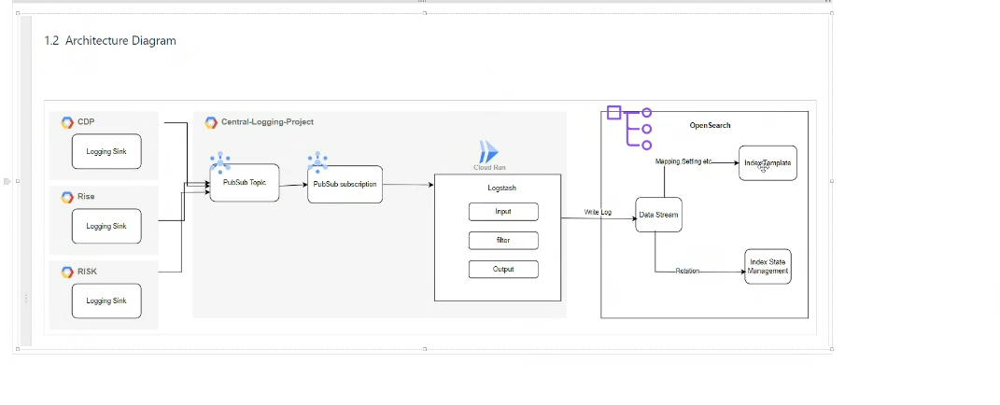

#               OPENSEARCH CENTRAL LOGGING PROJECT ON GCP

 
## 🔑 Project Description:
This is an End-to-End Opensearch Log analysis project on GCP using various GCP services like gce Instances, Logging Sinks, Google pubsub, Cloud Run & GKE to create a data pipeline that ships, parse, filter, anaylses, visualise & rollover metrics & logs.

## Prerequisites:
#### (a) Google cloud account
#### (b) gcloud cli
#### (c) IAM permissions for Service Account
#### (d) Service Account

## 🔑 Table of Content:

###  📋 Step 1: GCE instance Setup on GCP
###  📋 Step 2: Create Logging Sinks in GCP
###  📋 Step 3: Create Pub/Sub Topics
###  📋 Step 4: Create Subscriptions
###  📋 Step 5: Set Up Logstash Configuration
###  📋 Step 6: Create Dockerfile for Logstash
###  📋 Step 7: Build and Deploy Logstash to Cloud Run
###  📋 Step 8: Set Up OpenSearch on GKE
###  📋 Step 9: Verify the Setup
###  📋 Step 10: Opensearch Data Stream

======================================================================================================================================

    

###    📋 Step 1: GCE instance setup on GCP
####   1.1 Setting Up the VPC and Networking

For simplicity we will use the default VPC & subnet in the project

####   1.2 Provisioning gce VM Instances on GCP

#####   CDP Server instance

Open Cloud Shell in the GCP console or localhost shell terminal and run the command below after authentication to your gcp project.

    gcloud compute instances create cdp-application \
    --machine-type=e2-medium \
    --image-project=ubuntu-os-cloud \
    --image-family=ubuntu-2004-lts \
    --zone=us-central1-a \
    --boot-disk-size=20GB \
    --network=default \
    --subnet=default \
    --tags=cdp-server
    
#####   RISK Server instance

    gcloud compute instances create risk-application \
    --machine-type=e2-medium \
    --image-project=ubuntu-os-cloud \
    --image-family=ubuntu-2004-lts \
    --zone=us-central1-a \
    --boot-disk-size=20GB \
    --network=default \
    --subnet=default \
    --tags=risk-server

#####   RISE Server instance

    gcloud compute instances create rise-application \
    --machine-type=e2-medium \
    --image-project=ubuntu-os-cloud \
    --image-family=ubuntu-2004-lts \
    --zone=us-central1-a \
    --boot-disk-size=20GB \
    --network=default \
    --subnet=default \
    --tags=rise-server   
    

==========================================================================================================================================

###  📋 Step 2: Create Logging Sinks in GCP

Open Cloud Shell in the GCP console or localhost shell terminal and run the command.

To create the logging sinks for cdp, risk & rise application servers to the the google pubsub destination, use the following commands below:

     gcloud logging sinks create cdp-application-sink "pubsub.googleapis.com/projects/fast-planet-238810/topics/cdp-application-topic" --log-filter="resource.type=gce_instance"
     
     gcloud logging sinks create risk-application-sink "pubsub.googleapis.com/projects/fast-planet-238810/topics/risk-application-topic" --log-filter="resource.type=gce_instance"
     
     gcloud logging sinks create rise-application-sink "pubsub.googleapis.com/projects/fast-planet-238810/topics/rise-application-topic" --log-filter="resource.type=gce_instance"

=========================================================================================================================================

###  📋 Step 3: Create Google Pub/Sub Topics

Create the Pub/Sub topics for each logging sink:

    gcloud pubsub topics create rise-application-topic
    gcloud pubsub topics create risk-application-topic
    gcloud pubsub topics create cdp-application-topic
    
    

=======================================================================================================================================

###  📋 Step 4: Create Subscriptions

Create subscriptions for each topic:

    gcloud pubsub subscriptions create rise-application-sub --topic=rise-application-topic
    gcloud pubsub subscriptions create risk-application-sub --topic=risk-application-topic
    gcloud pubsub subscriptions create cdp-application-sub --topic=cdp-application-topic
    
    
    
======================================================================================================================================

###  📋 Step 5: Set Up Logstash Configuration

Create a Logstash configuration file named logstash.conf. This file will define how Logstash will read from Pub/Sub and send data to OpenSearch cluster in GKE

Logstash.conf file is located in the /logstast-conf folder in the github repository

=======================================================================================================================================

###  📋 Step 6: Create Dockerfile for Logstash

The Dockerfile is in the opensearch-gke-project folder

####  6.1 Create a Dockerfile for deploying Logstash in Cloud Run:

    FROM opensearchproject/logstash-oss-with-opensearch-output-plugin:8.9.0
    COPY logstash-config/logstash.conf /usr/share/logstash/pipeline/logstash.conf
    COPY keys/gcp-credentials.json /etc/logstash/gcp-credentials.json
    RUN bin/logstash-plugin install logstash-input-google_pubsub
    USER logstash
    CMD ["logstash", "-f", "/usr/share/logstash/pipeline/logstash.conf"]
    
    
    
####  6.2 Build the Docker image:

    docker build -t gcr.io/fast-planet-238810/logstash-oss-with-opensearch-output-plugin:v5-nossl .
    
    
####  6.3 Push the image to Google Container Registry:

    gcloud auth configure-docker
    
    docker push gcr.io/fast-planet-238810/logstash-oss-with-opensearch-output-plugin:v5-nossl

=============================================================================================================================================

###  📋 Step 7: Build and Deploy Logstash to Cloud Run

#### 7.1 Deploy your Logstash container to Cloud Run:

Navigate to the opensearch-gke-project folder containing the Dockerfile and logstash-config/logstash.conf in step 5 & 6 and run the command below:

    gcloud run deploy logstash-service \
    --image gcr.io/fast-planet-238810/logstash-oss-with-opensearch-output-plugin:v5-nossl \
    --platform managed \
    --region central1 \
    --allow-unauthenticated
    
Set environment variables on Cloud run:

    GOOGLE_APPLICATION_CREDENTIALS: /etc/logstash/gcp-credentials.json
    OPENSEARCH_HOST: internal loadbalancer IP
    OPENSEARCH_USER:  admin
    OPENSEARCH_PASSWORD: XXXXXXXX
    
Ensure that the logstash service account has the relevant permission to access pubsub.  The gcp-credential.json was added to the image so there will not be need for the command below. If that is not done, you will need this command below.  
    
    gcloud pubsub subscriptions add-iam-policy-binding RISE-sub \
    --member="serviceAccount:YOUR_CLOUD_RUN_SERVICE_ACCOUNT" \
    --role="roles/pubsub.subscriber"

    gcloud pubsub subscriptions add-iam-policy-binding RISK-sub \
    --member="serviceAccount:YOUR_CLOUD_RUN_SERVICE_ACCOUNT" \
    --role="roles/pubsub.subscriber"

    gcloud pubsub subscriptions add-iam-policy-binding CDP-sub \
    --member="serviceAccount:YOUR_CLOUD_RUN_SERVICE_ACCOUNT" \
    --role="roles/pubsub.subscriber"
    
    
Replace YOUR_CLOUD_RUN_SERVICE_ACCOUNT with the service account used by your Cloud Run service
    
    
    
================================================================================================================================================    

###  📋 Step 8: Set Up OpenSearch on GKE using Helm

#### 8.1 Create a GKE cluster

    gcloud container clusters create opensearch-cluster \
    --num-nodes=3 \
    --zone=us-central1-a \
    --machine-type=n1-standard-4 \
    --node-pool-name=opensearch-pool \
    --node-labels=nodepool=opensearch-pool
    
Get cluster Credentials:
    
    gcloud container clusters get-credentials opensearch-cluster --zone=us-central1-a

#### 8.2 Install Opensearch using Helm

Create a vlaues.yaml file or edit the one from the chart and place it in the root of the directory of opensearch-gke-project folder. you can change the version to the one you want but I used version 1.3.10

Bitnami opensearch Helm repository.

Add the OpenSearch Helm repository:

     helm repo add bitnami https://charts.bitnami.com/bitnami
     helm repo update
     
Install OpenSearch using Helm:

     helm install opensearch bitnami/opensearch -f values.yaml
     
     
Install OpenSearch-dashboard using Helm:

     helm install opensearch-dashboard bitnami/opensearch
     
Expose the Opensearch Cluster internal loadbalancer for the Logstash cloud run service to access
     
==========================================================================================================================================

###  📋 Step 9: Verify the Setup

Run the below command to verify log is been ingested from the gcd instance to the logging sink to the google pubsub through the logstash and indexed in the opensearch.

    gcloud run logs read logstash-service --region central1

Access OpenSearch Dashboards to visualize your logs.
Additional Considerations

    
###    📋 Step 10: Setup OPENSEARCH Index Template/Data Stream/ISM policy

####  10.1.1: Index template creation

Kindly develop a template that aligns with your expected log format.

Create cdp-access-log index template:

        PUT _index_template/cdp_access_logs_template
        {
          "index_patterns": ["cdp_access_logs-*", "risk_access_logs-*", "rise_access_logs-"],
          "data_stream": {},
          "template": {
            "settings": {
              "number_of_shards": 1,
              "number_of_replicas": 1
            },
            "mappings": {
              "properties": {
                "@timestamp": {
                  "type": "date"
                },
                "clientip": {
                  "type": "ip"
                },
                "ident": {
                  "type": "keyword"
                },
                "method": {
                  "type": "keyword"
                },
                "request": {
                  "type": "text"
                },
                "httpversion": {
                  "type": "keyword"
                },
                "response": {
                  "type": "integer"
                },
                "bytes": {
                  "type": "integer"
                },
                "referrer": {
                  "type": "keyword"
                },
                "user_agent": {
                  "type": "text"
                },
                "host": {
                  "type": "keyword"
                },
                "x_forwarded_for": {
                  "type": "keyword"
                },
                "accept_encoding": {
                  "type": "keyword"
                },
                "connection": {
                  "type": "keyword"
                },
                "content_length": {
                  "type": "keyword"
                },
                "content_type": {
                  "type": "keyword"
                }
              }
            }
          }
        }
        
        
NB: Repeat step 10.1.1 for risk_access_logs_template & rise_access_logs_template

#### 10.2 Create Data Stream:

        PUT _data_stream/cdp_access_logs
    

#### 10.3  Create ISM (Index State Management) Policy:

        PUT _plugins/_ism/policies/cdp_access_logs_policy
        {
          "policy": {
            "description": "Policy for managing cdp_access_logs data stream",
            "default_state": "hot",
            "states": [
              {
                "name": "hot",
                "actions": [
                  {
                    "rollover": {
                      "min_size": "1gb",
                      "min_age": "1d"
                    }
                  }
                ],
                "transitions": [
                  {
                    "state_name": "warm",
                    "conditions": {
                      "min_index_age": "2d"
                    }
                  }
                ]
              },
              {
                "name": "warm",
                "actions": [
                  {
                    "replica_count": {
                      "number_of_replicas": 1
                    }
                  }
                ],
                "transitions": [
                  {
                    "state_name": "cold",
                    "conditions": {
                      "min_index_age": "3d"
                    }
                  }
                ]
              },
              {
                "name": "cold",
                "actions": [
                  {
                    "replica_count": {
                      "number_of_replicas": 0
                    }
                  }
                ],
                "transitions": [
                  {
                    "state_name": "delete",
                    "conditions": {
                      "min_index_age": "7d"
                    }
                  }
                ]
              },
              {
                "name": "delete",
                "actions": [
                  {
                    "delete": {}
                  }
                ],
                "transitions": []
              }
            ]
          }
        }
        
        

   
   
   
#### 10.3   Apply the ISM Policy to the Data Stream:

        POST _plugins/_ism/add/cdp_access_logs
        {
          "policy_id": "cdp_access_logs_policy"
        }

